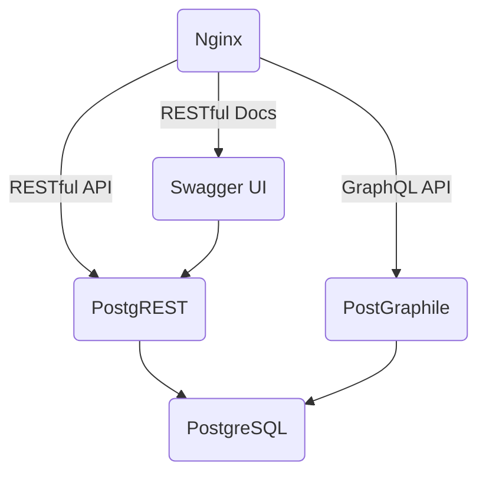

# Scriptura API

A powerful yet minimalist API that serves data on biblical verses, characters, events, places, connections and teological resources. The data is served through a RESTful API or GraphQL.

## Architecture

We follow the physolophy that:

- Less is more.
- Code sometimes can be a liability more than an asset.
- A central _Souce of Truth_ of our data schema is fundamental.

So our container-based architecture is PostgreSQL centered, extended with the following technologies:

## Usage

**Start the containers**

`docker-compose up -d`

**Tearing down the containers**

`docker-compose down --remove-orphans -v`

**Local Routing**

- `localhost:5432` - PostgreSQL
- `localhost/api` - Restful API
- `localhost/api/docs` - Swagger
- `localhost/graphql` - GraphQL API
- `localhost/graphiql` - GraphiQL Web IDE
